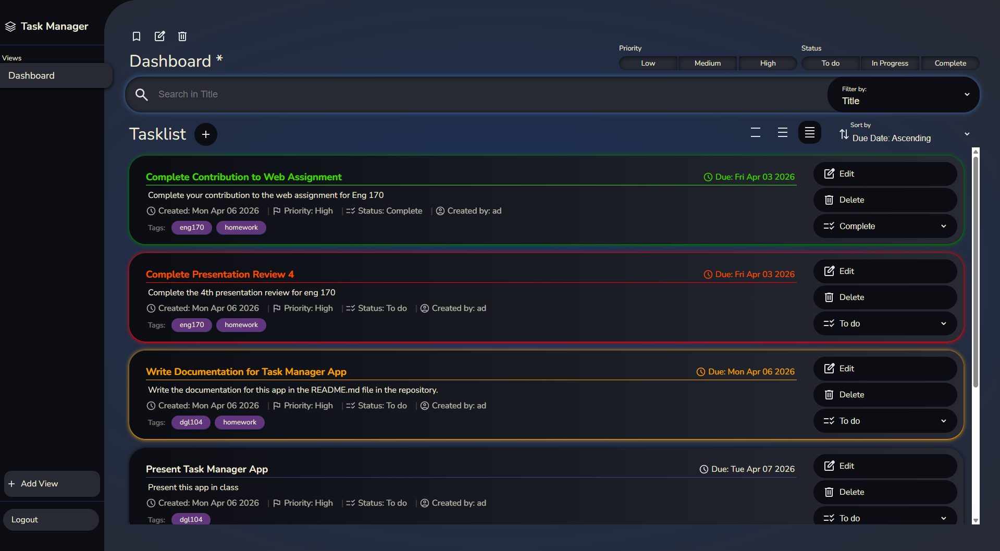
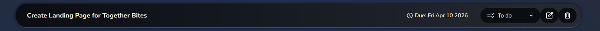
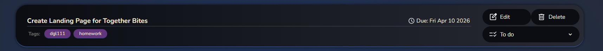
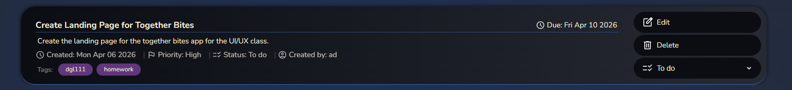
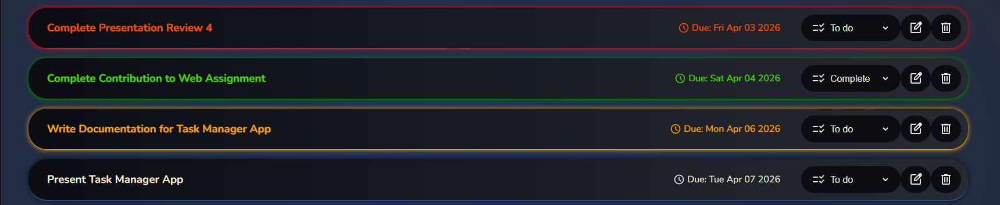

# DGL 104 - Task Management System (TMS)

<font size=5>Task Manager</font>

-----

*A tasklist displaying detailed task elements*

## Introduction
The Task Manager App provides users with a intuitive interface to create and manage simple tasks. Users can create, update, and delete tasks, and can group alike tasks or projects into different collections by saving specific filering and sorting preferences in a View. 

## Tech Stack
- HTML
- CSS
- Typescript
- IndexedDB

## Unique Features
- Create, View, Update, and Delete Tasks
- Track the progress of your tasks by setting the Task status to To Do, In Progress, or Complete
- Prioritize Tasks by setting the Task priority to Low, Medium, or High
- Add tags to each Task to easily find and filter Tasks belonging to certain projects
- Highlighting overdue tasks, tasks due today, and completed tasks to visually distinguish between them
- Sort Tasks according to various criteria (i.e. title, description, due date, etc.)
- Filter Tasks according to their Status, Priority, and a unique filter value provided in the Search Bar
- Create accounts and login to view and manage separate task lists 

## Design Patterns

### Singleton Pattern
The Task Manager App uses the Singleton Pattern to facilitate access to the database. Each ui class (for example, [tasks.ts](src/tasks/tasks.ts)) caches a reference to a singleton Service class ([TaskService.ts](src/tasks/TaskService.ts)) which communicates with a Repository class ([TaskRepository](src/tasks/TaskRepository.ts)) which connects to the database.

The Service classes imlement the Singleton pattern by defining a private static _instance variable and a public get Instance parameter. When the Instance parameter is first called, a new instance of the class is created and cached in the _instance member. Subsequent calls to service.Instance will return the cached _instance rather than constructing a new one. 

```typescript
private static _instance: TaskService;

static get Instance(): TaskService { 
    if (TaskService._instance == null) TaskService._instance = new TaskService();
    return TaskService._instance;
}
```

All Service classes implement this pattern. The [ViewHolder](src/views/ViewHolder.ts) also implements this pattern to make the current View and Viewlist easily accessible to the [views.ts](src/views/views.ts) and [tasks.ts](src/tasks/tasks.ts) ui scripts.

### Observer Pattern
The [ViewHolder](src/views/ViewHolder.ts) class implements the Observer Pattern to notify the [views.ts](src/views/views.ts) and [tasks.ts](src/tasks/tasks.ts) ui scripts when the current View has changed. This allows the views ui to update and highlight the current view in the sidebar, and allows the tasklist ui to update and filter the current tasklist according to the values specified in the view.

The Observer Pattern is implemented through the use of an [IObservable](src/interfaces/Observable.ts) interface and behaviours are defined in an abstract [Observerable](src/interfaces/Observable.ts) superclass.

```typescript
export interface IObservable<E> {
    _observers: ((event: E) => void)[];
    subscribe(callback: (event: E) => void): void;
    unsubscribe(callback: (event: E) => void): void;
    notify(event: E): void;
}

export abstract class Observable<E> implements IObservable<E> {
    _observers: ((event: E) => void)[] = [];

    subscribe(callback: (event: E) => void): void {
        this._observers.push(callback);
    }

    unsubscribe(callback: (event: E) => void): void {
        const index = this._observers.indexOf(callback);
        if (index >= 0) this._observers.splice(index, 1);
    }

    notify(event: E): void {
        for(let fun of this._observers) fun(event);
    }
}
```

I wanted to create IObservable as an interface first to allow subclasses to implement it, but defined the functionality in an abstract class as well so other classes without a superclass can inherit the functionality without any need to rewrite or copy the code.

The Observable class holds a list of observer functions which take a generic parameter of type E as an argument. If another class wants to subscribe to the Observable, the class can define ```function foo(bar: E): void``` and pass the function in as an argument to the Observable's subscribe method. When the Observable is updated, the notify event is called which invokes the observer functions.

### Factory Pattern
The Factory Pattern is used in the [TaskElementFactory](src/task_elements/TaskElementFactory.ts) to create different subclasses of TaskElement according to the currenttly defined TaskDisplayType. The TaskElementFactory is created in the tasks.ts ui script, and any time one of the display buttons is pressed, the value of the factory's _type field is set to the chosen display type (Compact, Basic, or Detailed). When taskFactory.create() is called, the method will return a TaskElement class of according to the chosen display type.

```typescript
public create(task: Task): TaskElement {
    let newElement: TaskElement;
    switch (this._type) {
        case TaskDisplayType.Detailed: 
            newElement = new DetailedTaskElement(task); break;   
        case TaskDisplayType.Compact: 
            newElement = new CompactTaskElement(task); break;   
        default: newElement = new BasicTaskElement(task)        
    }

    newElement.onEdit = this._onEdit;
    newElement.onDelete = this._onDelete;
    newElement.onSetStatus = this._onChangeStatus;
    
    // . . . ///

    return newElement;
}
```

With this implementation, different TaskElements can be easily created for in the factory and passed back to the UI for display.


*A Compact Task Element*


*A Compact Task Element*


*A Detailed Task Element*


----

### Decorator Pattern
The Task Factory also utilizes a decorators to further alter the task elements by assigning certain css classes depending upon various criteria. A task which is overdue (i.e. has a due date earlier than today) will be passed into the constructor of an OverdueTask decorator which will alter the tasks HTMLElement to highlight it in red in the task list. 

Similar decorators are used for tasks which are due today (highlighted in orange) and compelted tasks (highlighted in green).


*An overdue, completed, due today, and normal task from top to bottom*

## Installation Guidelines
This app can be accessed live at the following link: https://offerhallj.github.io/TaskManagerApp/index.html

To install a local version, simply download or clone the respository and open index.html in a browser. 

## Summary of the Project


## Contrubutions
This project was created entirely by Jared Hall for DGL-104 at North Island College.

## References
The following posts on StackOverFlow were referenced in the creation of this app:

https://stackoverflow.com/questions/2781549/removing-input-background-colour-for-chrome-autocomplete

This post was used in [styles.css](docs/styles/styles.css) to remove the detaulf auto-fill background color from the text input fields when an option is selected from the auto-fill dropdown.

---
https://blog.logrocket.com/using-indexeddb-complete-guide/

This article was referenced extensively in the creation of the repository classes to create and access data from IndexedDB 

---
https://stackoverflow.com/questions/75953640/how-to-get-event-target-result-in-javascript-indexdb-typescript-working

This post was used to figure out how to access the 'result' field from the EventTarget in the "upgradeneeded" event listener in the repository

---
https://stackoverflow.com/questions/503093/how-do-i-redirect-to-another-webpage

This post was used for the redirect code in [validatelogin.ts](src/login/validateLogin.ts) and elsewhere.

---
https://stackoverflow.com/questions/2998784/how-to-output-numbers-with-leading-zeros-in-javascript

I referenced this post to see how to add leading zeros to the date strings

---
https://medium.com/@kamresh485/a-comprehensive-guide-to-cursors-in-indexeddb-navigating-and-manipulating-data-with-ease-2793a2e01ba3

I referenced this article to get started with implementing cursors in the IndexedDB repositories

---
https://copilot.microsoft.com/shares/uyZawt3i8e5dBe4neqFcv

I used copilot to help resolve an issue with the methods being dropped from my Task class after trying to cast the result of a repository call as a Task (ie: ```let task: Task = cursor.value as Task```).

Copilot explained that the result was just a dataobject with fields which matched the Task class but which wasn't actually an instance of the class. Ultimately, I ended up just feeding the values from the database into the constructor of the class to manually construct the instance.

---
https://stackoverflow.com/questions/11217309/how-do-i-update-data-in-indexeddb

This post was used to help me set up the update methods in the repository classes/

--- 
https://blog.logrocket.com/iterate-over-enums-typescript/

This article was used to see how to iterate over the values of an enum

---
https://stackoverflow.com/questions/43837659/guid-uuid-in-typescript-node-js-app

This post was referenced to figure out how to create a UUId for the login authentication token created in [UserRepository](src/user/UserRepository.ts)

---
https://stackoverflow.com/questions/41769955/initialize-a-map-containing-arrays-in-typescript

This post was used to create a Map with initial values in [View.ts](src/views/View.ts).